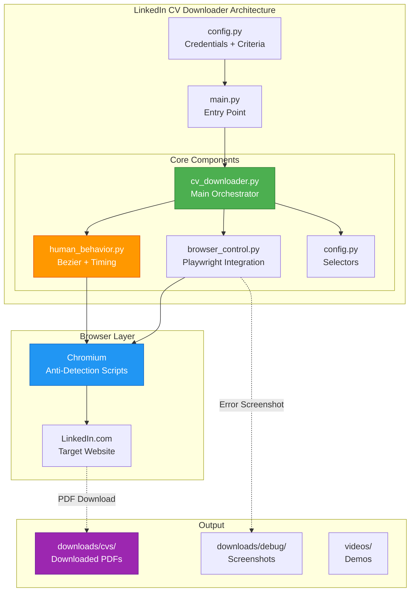
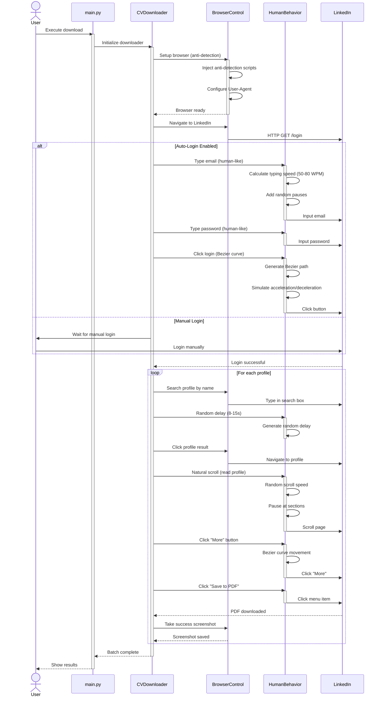
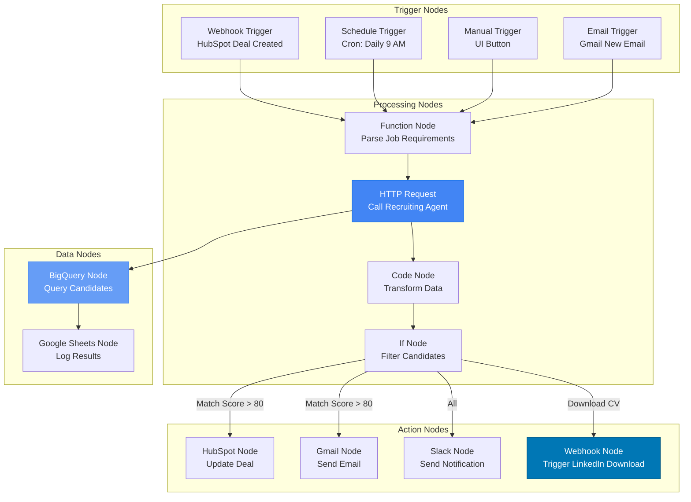
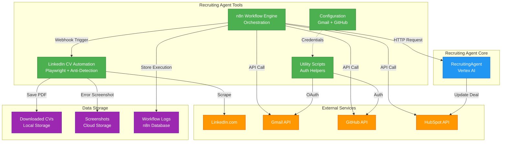
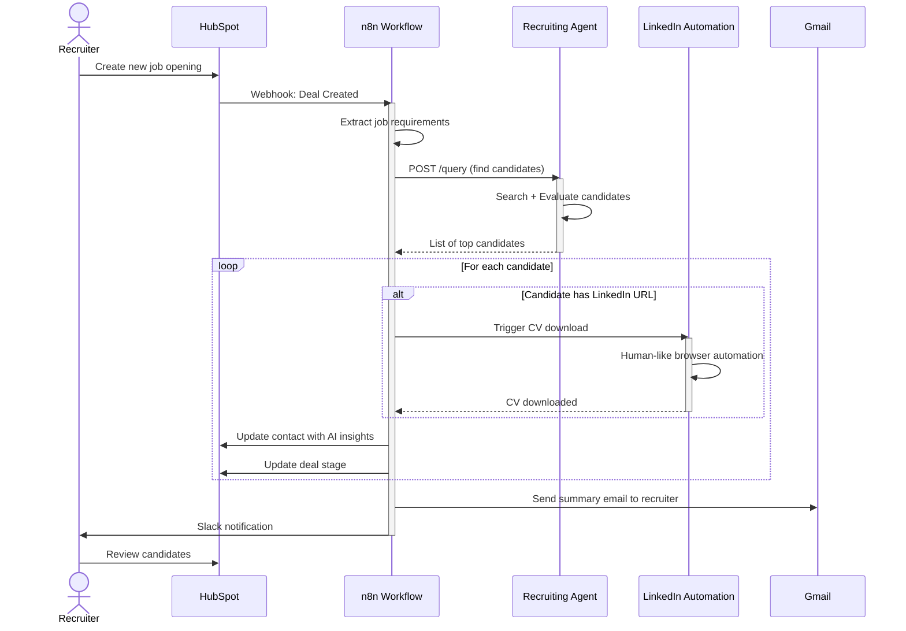

# Recruiting Agent Tools 🛠️

<div align="center">

**Herramientas de Automatización para Recruiting Agent**

[](https://www.linkedin.com/)
[](https://n8n.io/)
[](https://playwright.dev/)
[](https://www.python.org/)

**Automatización Web • Workflows • Integrations**

</div>

---

## 📋 Tabla de Contenidos

- [Descripción General](#-descripción-general)
- [Proyectos Incluidos](#-proyectos-incluidos)
  - [LinkedIn CV Automation](#1-linkedin-cv-automation)
  - [n8n Workflow Engine](#2-n8n-workflow-engine)
  - [Configuration Management](#3-configuration-management)
  - [Utility Scripts](#4-utility-scripts)
- [Arquitectura de Integración](#-arquitectura-de-integración)
- [Guía de Inicio Rápido](#-guía-de-inicio-rápido)
- [Casos de Uso](#-casos-de-uso)

---

## 🎯 Descripción General

Esta carpeta contiene **herramientas de automatización** y **proyectos auxiliares** que complementan el Recruiting Agent principal. Incluye sistemas de web scraping, motores de workflow, y utilidades para integración con servicios externos.

### Propósito

Proporcionar capacidades extendidas al Recruiting Agent:
- 📥 **Data Acquisition**: Descarga automatizada de CVs de LinkedIn
- 🔄 **Workflow Orchestration**: Automatización de procesos end-to-end con n8n
- 🔗 **External Integrations**: Conexión con Gmail, GitHub, y otros servicios
- 🤖 **Human Simulation**: Automatización web indistinguible de usuarios reales

---

## 🚀 Proyectos Incluidos

### 1. LinkedIn CV Automation

**Sistema automatizado de descarga de CVs de LinkedIn con comportamiento 100% humano**

<details>
<summary><b>📖 Detalles Completos</b></summary>

#### Características Destacadas

- ✅ **100% Indetectable**: Anti-detection completo con técnicas avanzadas
- ✅ **Auto-Login**: Autenticación automática sin intervención manual
- ✅ **Batch Processing**: Descarga múltiple de CVs en una sola sesión
- ✅ **Human Simulation**: Movimientos de mouse con curvas Bezier, timing natural, typing humano
- ✅ **Configuration-Based**: Todo configurable vía `config.py`
- ✅ **Error Recovery**: Screenshots automáticos y logging detallado

#### Arquitectura Técnica



#### Flujo de Descarga Detallado



#### Anti-Detection Features

| Técnica | Implementación | Impacto |
|---------|----------------|---------|
| **Webdriver Masking** | `navigator.webdriver = undefined` | Crítico |
| **Chrome Object Injection** | Realistic `window.chrome` con plugins | Alto |
| **Bezier Mouse Movements** | Curvas cuadráticas con aceleración variable | Crítico |
| **Human Typing** | 50-80 WPM con pausas aleatorias y errores ocasionales | Alto |
| **Random Delays** | 8-15s entre acciones, nunca repetitivo | Crítico |
| **Natural Scrolling** | Velocidad variable, pausas en secciones | Medio |
| **Profile Reading Simulation** | Tiempo de lectura basado en longitud de contenido | Medio |
| **Realistic User-Agent** | Chrome 120.0.6099.109 on Linux x86_64 | Bajo |
| **Viewport Randomization** | Tamaño de ventana variable | Bajo |

#### Configuración

**Archivo**: `linkedin_project/config.py`

```python
# ========== CREDENTIALS ==========
LINKEDIN_EMAIL = "your.email@example.com"
LINKEDIN_PASSWORD = "your_password"

# ========== DOWNLOAD CRITERIA ==========
# Option 1: Search by name
SEARCH_BY_NAME = True
PEOPLE_TO_DOWNLOAD = [
    "Sebastian Torres",
    "María González",
    "Carlos Ruiz"
]

# Option 2: Direct URLs
PROFILE_URLS = [
    "https://www.linkedin.com/in/username1/",
    "https://www.linkedin.com/in/username2/"
]

# ========== BEHAVIOR SETTINGS ==========
AUTO_LOGIN = True                # Auto-login vs manual
HEADLESS_MODE = False            # Show browser window
MAX_DOWNLOADS = 10               # Max CVs per session

# ========== TIMING (milliseconds) ==========
CUSTOM_TIMING = {
    # Delays entre acciones
    "between_actions_min": 8000,      # 8s
    "between_actions_max": 15000,     # 15s
    
    # Typing speed (words per minute)
    "typing_wpm_min": 50,
    "typing_wpm_max": 80,
    
    # Scrolling
    "scroll_pause_min": 500,
    "scroll_pause_max": 1500,
    
    # Profile reading time
    "profile_read_min": 3000,         # 3s
    "profile_read_max": 7000          # 7s
}

# ========== PATHS ==========
DOWNLOAD_DIR = "./downloads/cvs"
DEBUG_SCREENSHOT_DIR = "./downloads/debug"
```

#### Estructura del Proyecto

```
linkedin_project/
├── src/
│   └── linkedin_cv_downloader/
│       ├── __init__.py
│       ├── cv_downloader.py          # Main orchestrator class
│       ├── browser_control.py        # Playwright integration
│       ├── human_behavior.py         # Bezier curves + timing
│       └── config.py                 # Selectors + constants
│
├── examples/                         # Example scripts
│   ├── download_by_name.py
│   └── download_by_url.py
│
├── tests/                            # Testing
│   ├── test_downloader.py
│   └── visual_test.py
│
├── downloads/                        # Output
│   ├── cvs/                         # Downloaded PDFs
│   └── debug/                       # Debug screenshots
│
├── videos/                           # Demonstrations
│   └── demo_complete_workflow.webp
│
├── documentation/                    # Documentation
│   ├── CV_DOWNLOADER_README.md
│   ├── INSTALLATION.md
│   ├── USAGE.md
│   └── MISSION_COMPLETE.md
│
├── config.py                         # User configuration
├── main.py                           # Entry point
├── demo_video.py                     # Demo script
├── demo_live.py                      # Live demo
├── download_10_cvs.py                # Batch download
├── requirements.txt
└── README.md
```

#### Uso

**Instalación**:
```bash
cd recruiting_agent_tools/linkedin_project

# Instalar dependencias
pip install -r requirements.txt

# Instalar Playwright browsers
playwright install chromium
```

**Configuración**:
```bash
# Copiar ejemplo de configuración
cp config.example.py config.py

# Editar con tus credenciales
nano config.py
```

**Ejecución**:
```bash
# Modo completo (auto-login + batch)
python main.py

# Demo rápido (3 CVs)
python demo_video.py

# Descarga específica (10 CVs)
python download_10_cvs.py
```

**Uso Programático**:
```python
from src.linkedin_cv_downloader import LinkedInCVDownloader

# Initialize
downloader = LinkedInCVDownloader(headless=False)
downloader.setup_browser()

# Auto-login
downloader.auto_login("email@example.com", "password")

# Download single CV
downloader.download_cv_by_name("Sebastian Torres")

# Download batch
people = ["Person 1", "Person 2", "Person 3"]
downloader.download_multiple_cvs(people, search_by_name=True)

# Cleanup
downloader.close()
```

#### Output

**CVs descargados**:
```
downloads/cvs/
├── Sebastian_Torres_CV_20260107.pdf
├── María_González_CV_20260107.pdf
└── Carlos_Ruiz_CV_20260107.pdf
```

**Screenshots de debug** (si hay errores):
```
downloads/debug/
├── error_login_20260107_152030.png
├── error_profile_20260107_152130.png
└── success_download_20260107_152230.png
```

#### Video Demostración

Ver: `videos/demo_complete_workflow.webp`

Incluye:
- ✅ Login automático con typing humano
- ✅ Búsqueda de perfil con delays naturales
- ✅ Movimiento de mouse con curvas Bezier
- ✅ Scrolling natural en perfil
- ✅ Descarga de CV (Save to PDF)
- ✅ Completamente indetectable

</details>

---

### 2. n8n Workflow Engine

**Motor de automatización de workflows completo (fork del repositorio oficial)**

<details>
<summary><b>📖 Detalles Completos</b></summary>

#### Descripción

Copia completa del repositorio oficial de **n8n** para desarrollo local y creación de workflows personalizados que integran el Recruiting Agent y LinkedIn Automation.

#### Arquitectura de Workflows



#### Casos de Uso Específicos

**1. Automated Candidate Screening Workflow**

```
Trigger: HubSpot Deal Created (New Job Opening)
  ↓
Function: Extract job requirements from deal properties
  ↓
HTTP Request: POST /recruiting-agent/query
  {
    message: "Find candidates for {job_title}",
    context: {
      required_skills: [...],
      min_experience: X
    }
  }
  ↓
Code: Parse AI response and score candidates
  ↓
If: Match score > 80%
  ├─→ HubSpot: Update deal stage to "Qualified"
  ├─→ Gmail: Send email to recruiter
  └─→ Slack: Notify #recruiting channel
```

**2. Daily CV Download Batch**

```
Trigger: Schedule (Cron: 0 9 * * 1-5)  # 9 AM weekdays
  ↓
BigQuery: Query new candidate profiles from last 24h
  ↓
Function: Build list of LinkedIn URLs
  ↓
Webhook: POST /linkedin-downloader/batch
  {
    profile_urls: [...]
  }
  ↓
Wait: 30 minutes (allow LinkedIn automation to complete)
  ↓
Google Sheets: Log downloaded CVs
  ↓
Slack: Notify completion with stats
```

**3. Email-Triggered Profile Analysis**

```
Trigger: Gmail (New email with subject "Analyze candidate")
  ↓
Function: Extract LinkedIn URL from email body
  ↓
HTTP Request: GET LinkedIn profile data
  ↓
HTTP Request: POST /recruiting-agent/evaluate
  {
    profile_data: {...}
  }
  ↓
Gmail: Reply to email with evaluation
  ↓
HubSpot: Create/update contact with AI insights
```

#### Estructura del Proyecto

```
n8n-master/
├── packages/                       # n8n core packages
│   ├── cli/                        # n8n CLI
│   ├── core/                       # Core functionality
│   ├── nodes-base/                 # Built-in nodes
│   ├── workflow/                   # Workflow engine
│   └── ...
│
├── docker/                         # Docker configurations
│   ├── images/
│   └── compose/
│
├── .github/                        # CI/CD workflows
│
└── docs/                           # Documentation
```

#### Instalación y Uso

**Modo Development**:
```bash
cd recruiting_agent_tools/n8n-master

# Instalar dependencias
npm install

# Iniciar en modo dev
npm run dev

# Access UI
# http://localhost:5678
```

**Modo Docker**:
```bash
cd recruiting_agent_tools/n8n-master/docker/images/n8n

docker-compose up -d
```

#### Integración con Recruiting Agent

**Crear Workflow en UI**:

1. **Webhook Trigger Node**:
```json
{
  "httpMethod": "POST",
  "path": "recruiting-webhook",
  "responseMode": "onReceived"
}
```

2. **Function Node** (Prepare Request):
```javascript
// Extract data from webhook
const jobRequirements = $json.job_requirements;
const correlationId = $json.correlation_id || $uuid.v4();

// Prepare request for Recruiting Agent
return {
  json: {
    message: `Find candidates for ${jobRequirements.title}`,
    context: {
      required_skills: jobRequirements.skills,
      min_experience: jobRequirements.experience,
      location: jobRequirements.location
    },
    correlation_id: correlationId
  }
};
```

3. **HTTP Request Node** (Call Recruiting Agent):
```json
{
  "method": "POST",
  "url": "http://recruiting-agent-service/query",
  "authentication": "none",
  "sendHeaders": true,
  "headerParameters": {
    "parameters": [
      {
        "name": "X-Cloud-Trace-Context",
        "value": "={{$node['Function'].json.trace_context}}"
      }
    ]
  }
}
```

4. **Code Node** (Parse Response):
```javascript
// Parse AI response
const response = $json;
const candidates = extractCandidates(response.response);

// Score candidates
const scoredCandidates = candidates.map(c => ({
  ...c,
  matchScore: calculateMatchScore(c, $node['Function'].json.context)
}));

// Filter top candidates
return scoredCandidates
  .filter(c => c.matchScore > 80)
  .sort((a, b) => b.matchScore - a.matchScore);
```

5. **HubSpot Node** (Update Deal):
```json
{
  "resource": "deal",
  "operation": "update",
  "dealId": "={{$json.deal_id}}",
  "updateFields": {
    "dealstage": "qualified",
    "notes": "AI Agent found {{$json.length}} matching candidates"
  }
}
```

#### Custom Nodes (Futuro)

Posibles custom nodes a implementar:
- **Recruiting Agent Node**: Direct integration sin HTTP Request
- **LinkedIn Downloader Node**: Trigger LinkedIn automation desde workflow
- **Candidate Scorer Node**: Evaluación de skills con lógica customizada

</details>

---

### 3. Configuration Management

**Configuración centralizada para integraciones externas**

<details>
<summary><b>📖 Detalles</b></summary>

#### Estructura

```
config/
├── github/
│   └── README.md                 # GitHub integration setup
│
└── gmail/
    └── README.md                 # Gmail OAuth 2.0 setup
```

#### GitHub Integration

- **SSH Keys**: Configuración para autenticación
- **Git Config**: User/email para commits
- **API Tokens**: Personal Access Tokens para GitHub API

#### Gmail Integration

- **OAuth 2.0 Flow**: Autenticación con Google
- **API Credentials**: Client ID/Secret
- **Scopes**: Gmail read/send permissions
- **Token Storage**: Refresh tokens para acceso persistente

</details>

---

### 4. Utility Scripts

**Scripts auxiliares para tareas comunes**

<details>
<summary><b>📖 Detalles</b></summary>

#### Estructura

```
scripts/
├── gmail_auth.py               # Gmail OAuth authentication
└── gmail_auth_multi.py         # Multi-account Gmail auth
```

#### Gmail Authentication Scripts

**`gmail_auth.py`**: Autenticación OAuth 2.0 básica

```python
from google.oauth2.credentials import Credentials
from google_auth_oauthlib.flow import InstalledAppFlow
from google.auth.transport.requests import Request

SCOPES = ['https://www.googleapis.com/auth/gmail.readonly']

def authenticate():
    creds = None
    # Token storage logic
    if os.path.exists('token.json'):
        creds = Credentials.from_authorized_user_file('token.json', SCOPES)
    
    # If no valid credentials, run OAuth flow
    if not creds or not creds.valid:
        if creds and creds.expired and creds.refresh_token:
            creds.refresh(Request())
        else:
            flow = InstalledAppFlow.from_client_secrets_file(
                'credentials.json', SCOPES)
            creds = flow.run_local_server(port=0)
        
        # Save credentials
        with open('token.json', 'w') as token:
            token.write(creds.to_json())
    
    return creds
```

**Uso**:
```bash
cd recruiting_agent_tools/scripts

# First-time setup
python gmail_auth.py

# Multi-account setup
python gmail_auth_multi.py
```

</details>

---

## 🏗️ Arquitectura de Integración

### Vista de Alto Nivel



### Flujo End-to-End



---

## 🚀 Guía de Inicio Rápido

### Instalación Completa

```bash
# 1. Navegar a recruiting_agent_tools
cd /path/to/recruiting_agent/recruiting_agent_tools

# 2. LinkedIn Automation
cd linkedin_project
pip install -r requirements.txt
playwright install chromium
cp config.example.py config.py
# Edit config.py with credentials

# 3. n8n (Development)
cd ../n8n-master
npm install
npm run dev
# Access http://localhost:5678

# 4. Scripts de utilidad
cd ../scripts
pip install google-auth google-auth-oauthlib google-auth-httplib2
python gmail_auth.py  # Follow OAuth flow
```

### Verificación

```bash
# Test LinkedIn Automation
cd linkedin_project
python tests/visual_test.py

# Test n8n
curl http://localhost:5678/healthz

# Test Gmail Auth
cd ../scripts
python -c "from gmail_auth import authenticate; print(authenticate())"
```

---

## 📊 Casos de Uso

### Caso 1: Screening Automatizado Completo

**Objetivo**: Desde job opening hasta candidatos preseleccionados con CVs descargados

**Workflow**:
```
1. Recruiter crea deal en HubSpot
   ↓
2. n8n recibe webhook
   ↓
3. n8n llama a Recruiting Agent para buscar candidatos
   ↓
4. Recruiting Agent retorna top 10 matches
   ↓
5. Para cada candidato con LinkedIn:
   ├─→ n8n trigger LinkedIn Automation
   ├─→ LinkedIn Automation descarga CV
   └─→ CV guardado en downloads/cvs/
   ↓
6. n8n actualiza HubSpot con insights
   ↓
7. n8n envía email a recruiter con resumen
   ↓
8. Recruiter revisa candidatos en HubSpot
```

**Tiempo estimado**: 5-10 minutos (vs 2-3 horas manual)

---

### Caso 2: Monitoreo Diario de Nuevos Perfiles

**Objetivo**: Descargar CVs de nuevos candidatos que matchean requisitos activos

**Workflow**:
```
1. Cron trigger (9 AM daily)
   ↓
2. n8n query BigQuery: nuevos perfiles last 24h
   ↓
3. Para cada perfil:
   ├─→ Recruiting Agent evalúa match con jobs activos
   ├─→ Si match > 80%: Download CV via LinkedIn Automation
   └─→ Log a Google Sheets
   ↓
4. Slack notification con estadísticas diarias
```

---

### Caso 3: Bulk CV Download

**Objetivo**: Descarga masiva de CVs de lista de candidatos

**Workflow**:
```
1. Upload CSV con LinkedIn URLs a Google Sheets
   ↓
2. Manual trigger en n8n
   ↓
3. n8n lee Google Sheets
   ↓
4. Batch processing (10 CVs a la vez)
   ├─→ LinkedIn Automation download batch
   ├─→ Wait 5 minutes between batches
   └─→ Update progress in Sheets
   ↓
5. All CVs downloaded
   ↓
6. Gmail notification con link a carpeta de CVs
```

---

## 🛠️ Mantenimiento

### Actualizar Selectors de LinkedIn

Si LinkedIn cambia su UI:

```bash
cd linkedin_project/src/linkedin_cv_downloader

# Edit config.py
nano config.py
```

Actualizar selectores en sección `SELECTORS`:
```python
SELECTORS = {
    "search_box": 'input[placeholder*="Search"]',
    "more_button": 'button[aria-label*="More"]',
    "save_to_pdf": 'a[href*="save-to-pdf"]',
    # ... update as needed
}
```

### Actualizar n8n

```bash
cd n8n-master

# Pull latest changes
git pull origin master

# Reinstall dependencies
npm install

# Restart
npm run dev
```

---

## 📁 Estructura Completa

```
recruiting_agent_tools/
│
├── linkedin_project/                    # ⭐ LinkedIn CV Automation
│   ├── src/linkedin_cv_downloader/
│   │   ├── __init__.py
│   │   ├── cv_downloader.py
│   │   ├── browser_control.py
│   │   ├── human_behavior.py
│   │   └── config.py
│   ├── examples/
│   ├── tests/
│   ├── downloads/
│   │   ├── cvs/                        # Downloaded CVs
│   │   └── debug/                      # Debug screenshots
│   ├── videos/
│   ├── documentation/
│   ├── config.py                       # User configuration
│   ├── main.py
│   ├── demo_video.py
│   ├── requirements.txt
│   └── README.md
│
├── n8n-master/                          # ⭐ n8n Workflow Engine
│   ├── packages/
│   ├── docker/
│   ├── .github/
│   ├── package.json
│   └── README.md
│
├── config/                              # Configuration management
│   ├── github/
│   │   └── README.md
│   └── gmail/
│       └── README.md
│
├── scripts/                             # Utility scripts
│   ├── gmail_auth.py
│   └── gmail_auth_multi.py
│
├── first_agent/                         # (Legacy/experimental)
│
└── README.md                            # This file
```

---

## 🔐 Seguridad

- 🔒 **Credenciales**: Nunca commitear `config.py` con credenciales reales
- 🔒 **OAuth Tokens**: Almacenar tokens en archivos gitignored
- 🔒 **LinkedIn**: Rotar credenciales periódicamente
- 🔒 **n8n**: Usar autenticación básica en workflows expuestos

---

## 🐛 Troubleshooting

<details>
<summary><b>LinkedIn detecta automatización</b></summary>

**Soluciones**:
1. Aumentar delays en `config.py`: `between_actions_min/max`
2. Reducir número de downloads por sesión: `MAX_DOWNLOADS`
3. Usar IP diferente (VPN)
4. Esperar 24-48h antes de reintentar
</details>

<details>
<summary><b>n8n workflows no se guardan</b></summary>

**Soluciones**:
1. Verificar permisos de escritura en directorio de n8n
2. Verificar conexión a base de datos (SQLite por defecto)
3. Revisar logs: `~/.n8n/n8n.log`
</details>

<details>
<summary><b>Gmail OAuth falla</b></summary>

**Soluciones**:
1. Verificar `credentials.json` está presente
2. Borrar `token.json` y re-autenticar
3. Verificar scopes correctos en Google Cloud Console
4. Habilitar Gmail API en GCP project
</details>

---

## 📚 Documentación Adicional

- [LinkedIn Project - Complete README](linkedin_project/README.md)
- [LinkedIn Project - Installation Guide](linkedin_project/documentation/INSTALLATION.md)
- [LinkedIn Project - Usage Guide](linkedin_project/documentation/USAGE.md)
- [n8n - Official Documentation](https://docs.n8n.io/)
- [Playwright - Documentation](https://playwright.dev/python/docs/intro)

---

## 🤝 Contribución

Para añadir nuevas herramientas:

1. Crear subcarpeta con nombre descriptivo
2. Incluir README.md detallado
3. Añadir requirements.txt con dependencias
4. Documentar integración con Recruiting Agent
5. Incluir ejemplos de uso

---

## 📄 Licencia

Propiedad de **Jobsity**. Uso interno únicamente.

---

<div align="center">

**Made with ❤️ for Jobsity**

*Intelligent Automation • Human-Like Behavior • Production-Ready Tools*

</div>